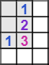

# minesweeper-solver

## Description

This is classic Minesweeper, played by an AI made by me.

This project was developed because I don't like that most solutions for Minesweeper AIs relies heavily on entropy (guessing) and wanted to make one that relies heavily on linear algebra.

I chose to implement the auto-clicker using Selenium because I recently got a job where that would play a large role, and I wanted a safe playground to learn more about how it works.

## Link

You can view the deployed page here:
https://moses-ian.github.io/minesweeper-solver/

You can download the bot here:
[Download](https://ians-cool-s3-bucket.s3.us-west-1.amazonaws.com/Minesweeper-Solver-Download-Package.zip)

## Usage

You can play the game yourself, like normal.
- Left click to reveal a square
- Right click to set or remove a flag. Flagged squares can't be mis-clicked.
- Refresh the page to start a new game.

You can download the bot and run it to see it in action.

**WARNING**

The best way to stop the bot is to uncheck the auto-refresh box on the page and let the bot finish the game itself. It will close the window automatically. If you close it yourself, you will have a hidden chromedriver.exe process running. You will have to open Task Manager and kill that process yourself.

## Brief Explanation of the Algorithms

### Overall Strategy

The bot clicks the center square to get started. The game is designed so that this square and all the squares around it have their mines moved away.

In each phase, the bot takes a screenshot, then chooses a specific pixel in each square. That pixel's color determines the value of the square, or whether it is still hidden. This generates a 16x30 matrix called the GameState.

The bot then turns that matrix into a much larger matrix (explained in detail in the next section). From there, the bot performs some linear algebra to see if there are safe squares. If there are, the bot will click them. If there are not, the bot has some methods for guessing (explained in their own sections).

The bot repeats this process until the game-over or finished element is displayed.

### The Main Matrix

The large, main matrix is a list of equations describing the game state in detail. 

Take this example, and let's say we have 3 mines here:

Let's call the top left square A, the top middle square B, the top right square C, and so on. Let's also say that if the square has a mine, the value of the square is 1. If it doesn't, the value is 0. This is different than the number of the square, which could be 0, 1, 2, etc, or hidden.

Row 0 of the matrix would be all zeros. That square is empty so we don't care about it.

To explain row 1, I first need to explain the corresponding equation. Equation 1 would be

`A + C + D + E + F = 1`

However, we can ignore revealed squares.

`C + F = 1`

The row of the matrix has 13 elements. The first 12 correspond to A-L, and are 1 if they're included in the equation, and 0 if not. The last element is the number displayed on the square. This means row 2 of the matrix is

`[0 0 1 0 0 1 0 0 0 0 0 0 1]`

Row 3 corresponds to a hidden square, so we will also leave that as all zeros.

Skipping ahead, the last row of the matrix is the sum of all hidden squares, totalling to the number of mines in the game. We can ignore the revealed squares, though.

`[0 0 1 0 0 1 0 0 1 1 1 1 3]`

Our final matrix looks like this:

	[0 0 0 0 0 0 0 0 0 0 0 0 0]
	[0 0 1 0 0 1 0 0 0 0 0 0 1]
	[0 0 0 0 0 0 0 0 0 0 0 0 0]
	[0 0 0 0 0 0 0 0 0 0 0 0 0]
	[0 0 1 0 0 1 0 0 1 0 0 0 2]
	[0 0 0 0 0 0 0 0 0 0 0 0 0]
	[0 0 0 0 0 0 0 0 0 1 1 0 1]
	[0 0 0 0 0 1 0 0 1 1 1 1 3]
	[0 0 0 0 0 0 0 0 0 0 0 0 0]
	[0 0 0 0 0 0 0 0 0 0 0 0 0]
	[0 0 0 0 0 0 0 0 0 0 0 0 0]
	[0 0 0 0 0 0 0 0 0 0 0 0 0]
	[0 0 1 0 0 1 0 0 1 1 1 1 3]

### Echelon Form

The next step is to bring it down to Echelon Form, like in linear algebra. Note, this is not row-reduced echelon form. That causes issues. We'll get to that later.

Our matrix looks like this:

	[0 0 1 0 0 1 0 0 0 0 0 0 1]
	[0 0 0 0 0 1 0 0 1 1 1 1 3]
	[0 0 0 0 0 0 0 0 1 0 0 0 1]
	[0 0 0 0 0 0 0 0 0 1 1 0 1]
	[0 0 0 0 0 0 0 0 0 0 0 1 0]
	[0 0 0 0 0 0 0 0 0 0 0 0 0]
	[0 0 0 0 0 0 0 0 0 0 0 0 0]
	[0 0 0 0 0 0 0 0 0 0 0 0 0]
	[0 0 0 0 0 0 0 0 0 0 0 0 0]
	[0 0 0 0 0 0 0 0 0 0 0 0 0]
	[0 0 0 0 0 0 0 0 0 0 0 0 0]
	[0 0 0 0 0 0 0 0 0 0 0 0 0]
	[0 0 0 0 0 0 0 0 0 0 0 0 0]

This matrix tells us one important fact, and one less-important fact.

Less important: Row 2 of this matrix corresponds to the equation

`I = 1`

Which means square I is a mine. That's good to know. But we're not here to find mines. We're here to find safe squares.

More important: Row 4 corresponds to

`L = 0`

Which means square L is safe! We can click it! This result is very counter-intuitive, and is only safe because we know there are exactly 3 mines on this board.

One step not shown here is splitting rows. Say we had a row that looked like this:

`[0 0 0 0 0 0 0 0 0 0 1 1 2]`

We know that squares K and L must be mines. So they could easily be split up, like so:

	[0 0 0 0 0 0 0 0 0 0 1 0 1]
	[0 0 0 0 0 0 0 0 0 0 0 1 1]

This is not a real thing in linear algebra. It's only possible because of the unique problem. After each echelon step, we split rows in this manner. This avoids problems down the line.

### Row-Reduced Echelon Form

Echelon form usually produces clickable squares. In cases where it doesn't, we can proceed to row-reduced echelon form, where we might find safe squares.

### Brute Force Solve

If we still can't find safe squares, there is one more trick. Up to this point, we have been evaluating equations on their own. However, linear algebra is all about <em>systems</em> of equations. Take these two equations:

	A + B - C = 0
	A + C - D = 0

Taken individually, they tell us nothing. Taken together, they can only both be true if A is zero. We can't tell what B, C, and D are yet, but revealing A might give us enough information to solve this.

The bot implements this with a brute force algorithm with pruning, checking all of the equations together. However, if there are two many variables, the brute force method takes too long, and the bot skips this step.

### Guessing based on entropy

The brute force method might not find any safe squares. However, it will generate an array of how often each square was a mine. The bot chooses the square that is least likely to be a mine and clicks it.

### Guessing without entropy

As a last-ditch effort, the bot searches top-left to bottom-right for a square where all 8 neighbors are hidden and clicks it. This is how I play and I would like to hear your thoughts on a better way to guess.

## Credits

The Coding Train - Coding Challenge #71: Minesweeper:
https://www.youtube.com/watch?v=LFU5ZlrR21E

## Created by Ian Moses

https://github.com/Moses-Ian

https://moses-ian.github.io/portfolio/

https://www.linkedin.com/in/moses-ian/
